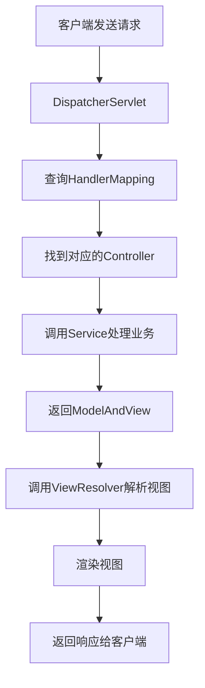

# JavaEE 简答题汇总

## 1. HTTP常识、协议、返回值，HTML起什么作用，CSS，JS

### HTTP协议常识
- **HTTP协议**：超文本传输协议，基于TCP/IP的应用层协议，用于客户端和服务器之间的通信
- **主要特点**：无状态、无连接（HTTP/1.1支持持久连接）、基于请求/响应模型
- **端口**：默认端口80（HTTP）和443（HTTPS）

### HTTP请求方法
| 方法 | 用途 | 特点 |
|------|------|------|
| GET | 获取资源 | 参数在URL中，有长度限制 |
| POST | 提交数据 | 参数在请求体中，无长度限制 |
| PUT | 更新资源 |  |

### HTTP状态码
| 状态码 | 类别 | 常见示例 |
|--------|------|----------|
| 1xx | 信息响应 | 100 Continue |
| 2xx | 成功响应 | 200 OK, 201 Created |
| 3xx | 重定向 | 301 Moved Permanently |
| 4xx | 客户端错误 | 404 Not Found |
| 5xx | 服务器错误 | 500 Internal Server Error |

### 前端三剑客的作用
| 技术 | 作用 | 比喻 |
|------|------|------|
| **HTML** | 超文本标记语言，定义网页的结构和内容 | 骨架 |
| **CSS** | 层叠样式表，控制网页的样式和布局 | 外观 |
| **JavaScript** | 脚本语言，实现网页的交互行为和动态效果 | 行为 |

---

## 2. JSP Servlet里的常见概念、HttpRequest、HttpServlet、Response作用

### JSP（Java Server Pages）
- **定义**：基于Java的服务器端动态网页技术
- **特点**：允许在HTML中嵌入Java代码（`<% ... %>`）
- **生命周期**：JSP → 翻译成Servlet → 编译 → 执行

### Servlet
- **定义**：运行在服务器端的Java程序，处理HTTP请求并生成响应
- **生命周期**：
  1. **初始化**：`init()`方法
  2. **服务**：`service()`方法（调用`doGet()`/`doPost()`）
  3. **销毁**：`destroy()`方法

### HttpServletRequest的作用
- **获取客户端信息**：IP地址、端口、请求头
- **获取请求参数**：`getParameter()`、`getParameterValues()`
- **获取会话对象**：`getSession()`
- **获取作用域对象**：`getServletContext()`、`getRequestDispatcher()`
- **获取Cookie**：`getCookies()`

### HttpServletResponse的作用
- **设置响应状态**：`setStatus()`
- **设置响应头**：`setHeader()`、`addHeader()`
- **设置内容类型**：`setContentType()`
- **获取输出流**：`getWriter()`、`getOutputStream()`
- **重定向**：`sendRedirect()`
- **Cookie操作**：`addCookie()`

### 常见对象对比
| 对象 | 作用域 | 生命周期 |
|------|--------|----------|
| `HttpServletRequest` | 一次请求 | 请求开始到结束 |
| `HttpSession` | 一次会话 | 会话开始到超时或失效 |
| `ServletContext` | 整个应用 | 应用启动到关闭 |

---

## 3. MVC起什么作用

### MVC定义
- **MVC**：Model-View-Controller，一种软件设计模式
- **目的**：分离业务逻辑、数据和界面显示，降低耦合度

### 三个组件的职责
| 组件 | 职责 |
|------|------|
| **Model（模型）** | 处理应用程序数据逻辑；与数据库交互；通知View数据变化 |
| **View（视图）** | 显示数据给用户；接收用户输入；向Controller发送用户请求 |
| **Controller（控制器）** | 接收用户请求；调用Model处理业务；选择合适的View显示结果 |

### MVC在Java Web中的实现
| 组件 | Java Web实现 |
|------|--------------|
| Model | JavaBean、Service、DAO |
| View | JSP、HTML |
| Controller | Servlet、Struts Action、SpringMVC Controller |

### MVC的优点
1. **分离关注点**：业务逻辑与显示分离
2. **易于维护**：修改不影响其他组件
3. **代码重用**：模型和控制器可重用
4. **并行开发**：不同开发者可同时工作

### MVC的缺点
1. **增加复杂性**：简单的应用可能过度设计
2. **性能开销**：需要额外的协调工作

---

## 4. SpringMVC怎么操作

### SpringMVC核心组件
| 组件 | 作用 |
|------|------|
| `DispatcherServlet` | 前端控制器，统一接收请求并分发 |
| `HandlerMapping` | 请求映射处理器，将URL映射到Controller |
| `Controller` | 业务处理器 |
| `ViewResolver` | 视图解析器 |
| `ModelAndView` | 封装模型数据和视图信息 |

### SpringMVC工作流程


### 基本配置示例

#### 1. web.xml配置DispatcherServlet
```xml
<servlet>
    <servlet-name>dispatcher</servlet-name>
    <servlet-class>org.springframework.web.servlet.DispatcherServlet</servlet-class>
    <init-param>
        <param-name>contextConfigLocation</param-name>
        <param-value>/WEB-INF/spring-mvc.xml</param-value>
    </init-param>
    <load-on-startup>1</load-on-startup>
</servlet>
```

#### 2. Controller示例
```java
@Controller
@RequestMapping("/user")
public class UserController {
    
    @Autowired
    private UserService userService;
    
    @RequestMapping(value = "/list", method = RequestMethod.GET)
    public String listUsers(Model model) {
        List<User> users = userService.getAllUsers();
        model.addAttribute("users", users);
        return "user/list";
    }
    
    @RequestMapping(value = "/add", method = RequestMethod.POST)
    @ResponseBody
    public String addUser(@RequestParam String username, 
                         @RequestParam String email) {
        // 处理添加用户逻辑
        return "success";
    }
}
```

### 常用注解
| 注解 | 作用 |
|------|------|
| `@Controller` | 声明为控制器 |
| `@RequestMapping` | 映射请求URL |
| `@RequestParam` | 获取请求参数 |
| `@PathVariable` | 获取路径参数 |
| `@ResponseBody` | 返回JSON数据 |

### 参数绑定方式
| 参数类型 | 绑定方式 |
|----------|----------|
| 基本类型参数 | `@RequestParam` |
| 对象参数 | 自动绑定同名属性 |
| 路径参数 | `@PathVariable` |
| JSON参数 | `@RequestBody + 对象` |

---

## 5. ORM的概念

### ORM定义
- **ORM**：Object-Relational Mapping，对象关系映射
- **目的**：将面向对象的编程语言与关系数据库进行映射

### ORM核心思想
- 将数据库表映射为Java类
- 将表字段映射为类属性
- 将表记录映射为对象实例
- 将SQL操作封装为对象方法

### ORM框架举例
| 框架 | 特点 |
|------|------|
| Hibernate | 最流行的ORM框架 |
| MyBatis | 半自动ORM框架 |
| Spring Data JPA | 基于JPA规范 |
| JPA | Java持久化API规范 |

### Hibernate核心组件

#### 1. 实体类映射
```java
@Entity
@Table(name = "user")
public class User {
    @Id
    @GeneratedValue(strategy = GenerationType.IDENTITY)
    private Integer id;
    
    @Column(name = "username")
    private String username;
    
    @Column(name = "email")
    private String email;
    // getters/setters
}
```

#### 2. 核心组件
- **配置文件**：`hibernate.cfg.xml`
- **SessionFactory**：创建Session的工厂
- **Session**：主要操作接口
- **Transaction**：事务管理

### ORM操作示例对比

#### 传统JDBC操作
```java
String sql = "INSERT INTO user(username, email) VALUES (?, ?)";
PreparedStatement ps = connection.prepareStatement(sql);
ps.setString(1, "john");
ps.setString(2, "john@example.com");
ps.executeUpdate();
```

#### ORM操作（Hibernate）
```java
Session session = sessionFactory.openSession();
Transaction tx = session.beginTransaction();
User user = new User();
user.setUsername("john");
user.setEmail("john@example.com");
session.save(user);
tx.commit();
session.close();
```

### ORM的优点
1. **提高开发效率**：减少SQL编写
2. **对象化操作**：符合面向对象思想
3. **数据库无关性**：更换数据库方便
4. **缓存机制**：提高性能
5. **安全性**：防止SQL注入

### ORM的缺点
1. **学习成本**：需要学习框架
2. **性能问题**：复杂查询可能效率低
3. **灵活性限制**：某些复杂SQL难以实现
4. **调试困难**：生成的SQL不易调试

---

## 问题汇总
1. http常识、协议、返回值，html起什么作用 css js
2. jsp servlet里的一些常见概念、HttpRequest、HttpServlet、response起什么作用
3. mvc起什么作用
4. SpringMVC怎么操作
5. ORM的概念

---

## 关于Spring

### Spring最核心的东西
- **IoC**（控制反转）：不考，但要知道作用
  - **作用**：避免用new来创建对象，而是容器、配置文件自动生成
  - **优点**：灵活，减少函数依赖
- **AOP**（面向切面编程）：不考

### Spring集成MVC
- Spring集成了MVC
- MVC概念：Model + Controller + View

### IoC的2种方法
1. **配置bean**：通过XML配置文件
2. **注解**（主流）：使用`@`注解符

`spring-mvc.xml`:需要写入以下配置以扫描注解符号
```xml
<context:component-scan base-package="com.atguigu.spring.beans" resource-pattern="autowire/*.class"/>
```

### 常见注解符
| 注解 | 说明 |
|------|------|
| `@Component` | 通用组件注解 |
| `@Service` | 服务层注解 |
| `@Repository` | 数据访问层注解 |
| `@Controller` | 控制器层注解 |
| `@Autowired` | 自动装配依赖 |

### 配置文件
使用配置文件之后需要配置Spring配置文件，通常为：
- `applicationContext.xml`
- `spring-mvc.xml`

### SpringMVC的工作流程(必须要掌握)：

