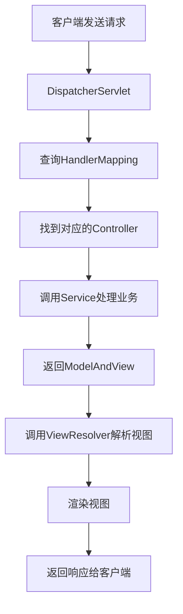

# JavaEE 简答题汇总

## 1. HTTP常识、协议、返回值，HTML起什么作用，CSS，JS

### HTTP协议常识
- **HTTP协议**：超文本传输协议，基于TCP/IP的应用层协议，用于客户端和服务器之间的通信
- **主要特点**：无状态、无连接（HTTP/1.1支持持久连接）、基于请求/响应模型
- **端口**：默认端口80（HTTP）和443（HTTPS）

### HTTP请求方法
| 方法 | 用途 | 特点 |
|------|------|------|
| GET | 获取资源 | 参数在URL中，有长度限制 |
| POST | 提交数据 | 参数在请求体中，无长度限制 |
| PUT | 更新资源 |  |

### HTTP状态码
| 状态码 | 类别 | 常见示例 |
|--------|------|----------|
| 1xx | 信息响应 | 100 Continue |
| 2xx | 成功响应 | 200 OK, 201 Created |
| 3xx | 重定向 | 301 Moved Permanently |
| 4xx | 客户端错误 | 404 Not Found |
| 5xx | 服务器错误 | 500 Internal Server Error |

### 前端三剑客的作用
| 技术 | 作用 | 比喻 |
|------|------|------|
| **HTML** | 超文本标记语言，定义网页的结构和内容 | 骨架 |
| **CSS** | 层叠样式表，控制网页的样式和布局 | 外观 |
| **JavaScript** | 脚本语言，实现网页的交互行为和动态效果 | 行为 |

---

## 2. JSP Servlet里的常见概念、HttpRequest、HttpServlet、Response作用

### JSP（Java Server Pages）
- **定义**：基于Java的服务器端动态网页技术
- **特点**：允许在HTML中嵌入Java代码（`<% ... %>`）
- **生命周期**：JSP → 翻译成Servlet → 编译 → 执行

### Servlet
- **定义**：运行在服务器端的Java程序，处理HTTP请求并生成响应
- **生命周期**：
  1. **初始化**：`init()`方法
  2. **服务**：`service()`方法（调用`doGet()`/`doPost()`）
  3. **销毁**：`destroy()`方法

### HttpServletRequest的作用
- **获取客户端信息**：IP地址、端口、请求头
- **获取请求参数**：`getParameter()`、`getParameterValues()`
- **获取会话对象**：`getSession()`
- **获取作用域对象**：`getServletContext()`、`getRequestDispatcher()`
- **获取Cookie**：`getCookies()`

### HttpServletResponse的作用
- **设置响应状态**：`setStatus()`
- **设置响应头**：`setHeader()`、`addHeader()`
- **设置内容类型**：`setContentType()`
- **获取输出流**：`getWriter()`、`getOutputStream()`
- **重定向**：`sendRedirect()`
- **Cookie操作**：`addCookie()`

### 常见对象对比
| 对象 | 作用域 | 生命周期 |
|------|--------|----------|
| `HttpServletRequest` | 一次请求 | 请求开始到结束 |
| `HttpSession` | 一次会话 | 会话开始到超时或失效 |
| `ServletContext` | 整个应用 | 应用启动到关闭 |

---

## 3. MVC起什么作用

### MVC定义
- **MVC**：Model-View-Controller，一种软件设计模式
- **目的**：分离业务逻辑、数据和界面显示，降低耦合度

### 三个组件的职责
| 组件 | 职责 |
|------|------|
| **Model（模型）** | 处理应用程序数据逻辑；与数据库交互；通知View数据变化 |
| **View（视图）** | 显示数据给用户；接收用户输入；向Controller发送用户请求 |
| **Controller（控制器）** | 接收用户请求；调用Model处理业务；选择合适的View显示结果 |

### MVC在Java Web中的实现
| 组件 | Java Web实现 |
|------|--------------|
| Model | JavaBean、Service、DAO |
| View | JSP、HTML |
| Controller | Servlet、Struts Action、SpringMVC Controller |

### MVC的优点
1. **分离关注点**：业务逻辑与显示分离
2. **易于维护**：修改不影响其他组件
3. **代码重用**：模型和控制器可重用
4. **并行开发**：不同开发者可同时工作

### MVC的缺点
1. **增加复杂性**：简单的应用可能过度设计
2. **性能开销**：需要额外的协调工作

---

## 4. SpringMVC怎么操作

### SpringMVC核心组件
| 组件 | 作用 |
|------|------|
| `DispatcherServlet` | 前端控制器，统一接收请求并分发 |
| `HandlerMapping` | 请求映射处理器，将URL映射到Controller |
| `Controller` | 业务处理器 |
| `ViewResolver` | 视图解析器 |
| `ModelAndView` | 封装模型数据和视图信息 |

### SpringMVC工作流程


### 基本配置示例

#### 1. web.xml配置DispatcherServlet
```xml
<servlet>
    <servlet-name>dispatcher</servlet-name>
    <servlet-class>org.springframework.web.servlet.DispatcherServlet</servlet-class>
    <init-param>
        <param-name>contextConfigLocation</param-name>
        <param-value>/WEB-INF/spring-mvc.xml</param-value>
    </init-param>
    <load-on-startup>1</load-on-startup>
</servlet>
```

#### 2. Controller示例
```java
@Controller
@RequestMapping("/user")
public class UserController {
    
    @Autowired
    private UserService userService;
    
    @RequestMapping(value = "/list", method = RequestMethod.GET)
    public String listUsers(Model model) {
        List<User> users = userService.getAllUsers();
        model.addAttribute("users", users);
        return "user/list";
    }
    
    @RequestMapping(value = "/add", method = RequestMethod.POST)
    @ResponseBody
    public String addUser(@RequestParam String username, 
                         @RequestParam String email) {
        // 处理添加用户逻辑
        return "success";
    }
}
```

#### 3. Service示例
接口；
```java
package com.example.service;

import com.example.model.User;
import java.util.List;

/**
 * 用户服务接口
 */
public interface UserService {
    
    /**
     * 获取所有用户
     */
    List<User> getAllUsers();
    
    /**
     * 根据ID获取用户
     */
    User getUserById(Long id);
    
    /**
     * 添加用户
     */
    boolean addUser(User user);
    
    /**
     * 更新用户
     */
    boolean updateUser(User user);
    
    /**
     * 删除用户
     */
    boolean deleteUser(Long id);
    
    /**
     * 根据用户名查询用户
     */
    List<User> findUsersByName(String name);
    
    /**
     * 用户登录验证
     */
    User login(String username, String password);
}
```
Service示例：
```java
package com.example.service.impl;

import com.example.service.UserService;
import com.example.dao.UserDao;
import com.example.model.User;
import org.springframework.beans.factory.annotation.Autowired;
import org.springframework.stereotype.Service;
import org.springframework.transaction.annotation.Transactional;
import java.util.List;

/**
 * 用户服务实现类
 * @Service 注解：标记为Spring服务组件，会被自动扫描并注入
 * @Transactional 注解：声明事务管理
 */
@Service
@Transactional
public class UserServiceImpl implements UserService {
    
    @Autowired
    private UserDao userDao;  // 数据访问层接口
    
    /**
     * 获取所有用户
     */
    @Override
    public List<User> getAllUsers() {
        return userDao.findAll();
    }
    
    /**
     * 根据ID获取用户
     */
    @Override
    public User getUserById(Long id) {
        if (id == null || id <= 0) {
            throw new IllegalArgumentException("用户ID不合法");
        }
        return userDao.findById(id);
    }
    
    /**
     * 添加用户
     */
    @Override
    public boolean addUser(User user) {
        // 参数校验
        if (user == null || user.getUsername() == null || user.getUsername().trim().isEmpty()) {
            throw new IllegalArgumentException("用户信息不完整");
        }
        
        // 检查用户名是否已存在
        if (userDao.existsByUsername(user.getUsername())) {
            throw new RuntimeException("用户名已存在");
        }
        
        // 设置默认值
        if (user.getCreateTime() == null) {
            user.setCreateTime(new Date());
        }
        
        // 调用DAO层保存
        return userDao.save(user) > 0;
    }
    
    /**
     * 更新用户
     */
    @Override
    public boolean updateUser(User user) {
        if (user == null || user.getId() == null) {
            throw new IllegalArgumentException("用户ID不能为空");
        }
        
        // 检查用户是否存在
        User existingUser = userDao.findById(user.getId());
        if (existingUser == null) {
            throw new RuntimeException("用户不存在");
        }
        
        // 更新用户信息
        existingUser.setEmail(user.getEmail());
        existingUser.setPhone(user.getPhone());
        existingUser.setUpdateTime(new Date());
        
        return userDao.update(existingUser) > 0;
    }
    
    /**
     * 删除用户
     */
    @Override
    public boolean deleteUser(Long id) {
        if (id == null || id <= 0) {
            throw new IllegalArgumentException("用户ID不合法");
        }
        
        // 检查用户是否存在
        User user = userDao.findById(id);
        if (user == null) {
            return false;
        }
        
        return userDao.delete(id) > 0;
    }
    
    /**
     * 根据用户名查询用户
     */
    @Override
    public List<User> findUsersByName(String name) {
        if (name == null || name.trim().isEmpty()) {
            return new ArrayList<>();
        }
        return userDao.findByUsernameLike("%" + name + "%");
    }
    
    /**
     * 用户登录验证
     */
    @Override
    public User login(String username, String password) {
        if (username == null || password == null) {
            throw new IllegalArgumentException("用户名和密码不能为空");
        }
        
        // 根据用户名查询用户
        User user = userDao.findByUsername(username);
        if (user == null) {
            throw new RuntimeException("用户不存在");
        }
        
        // 验证密码（实际项目中应该加密存储和比较）
        if (!password.equals(user.getPassword())) {
            throw new RuntimeException("密码错误");
        }
        
        // 更新最后登录时间
        user.setLastLoginTime(new Date());
        userDao.updateLoginTime(user.getId());
        
        return user;
    }
}
```
### 常用注解
| 注解 | 作用 |
|------|------|
| `@Controller` | 声明为控制器 |
| `@RequestMapping` | 映射请求URL |
| `@RequestParam` | 获取请求参数 |
| `@PathVariable` | 获取路径参数 |
| `@ResponseBody` | 返回JSON数据 |

### 参数绑定方式
| 参数类型 | 绑定方式 |
|----------|----------|
| 基本类型参数 | `@RequestParam` |
| 对象参数 | 自动绑定同名属性 |
| 路径参数 | `@PathVariable` |
| JSON参数 | `@RequestBody + 对象` |

---

## 5. ORM的概念

### ORM定义
- **ORM**：Object-Relational Mapping，对象关系映射
- **目的**：将面向对象的编程语言与关系数据库进行映射

### ORM核心思想
- 将数据库表映射为Java类
- 将表字段映射为类属性
- 将表记录映射为对象实例
- 将SQL操作封装为对象方法

### ORM框架举例
| 框架 | 特点 |
|------|------|
| Hibernate | 最流行的ORM框架 |
| MyBatis | 半自动ORM框架 |
| Spring Data JPA | 基于JPA规范 |
| JPA | Java持久化API规范 |

### Hibernate核心组件

#### 1. 实体类映射
```java
@Entity
@Table(name = "user")
public class User {
    @Id
    @GeneratedValue(strategy = GenerationType.IDENTITY)
    private Integer id;
    
    @Column(name = "username")
    private String username;
    
    @Column(name = "email")
    private String email;
    // getters/setters
}
```

#### 2. 核心组件
- **配置文件**：`hibernate.cfg.xml`
- **SessionFactory**：创建Session的工厂
- **Session**：主要操作接口
- **Transaction**：事务管理

### ORM操作示例对比

#### 传统JDBC操作
```java
String sql = "INSERT INTO user(username, email) VALUES (?, ?)";
PreparedStatement ps = connection.prepareStatement(sql);
ps.setString(1, "john");
ps.setString(2, "john@example.com");
ps.executeUpdate();
```

#### ORM操作（Hibernate）
```java
Session session = sessionFactory.openSession();
Transaction tx = session.beginTransaction();
User user = new User();
user.setUsername("john");
user.setEmail("john@example.com");
session.save(user);
tx.commit();
session.close();
```

### ORM的优点
1. **提高开发效率**：减少SQL编写
2. **对象化操作**：符合面向对象思想
3. **数据库无关性**：更换数据库方便
4. **缓存机制**：提高性能
5. **安全性**：防止SQL注入

### ORM的缺点
1. **学习成本**：需要学习框架
2. **性能问题**：复杂查询可能效率低
3. **灵活性限制**：某些复杂SQL难以实现
4. **调试困难**：生成的SQL不易调试

---

## 问题汇总
1. http常识、协议、返回值，html起什么作用 css js
2. jsp servlet里的一些常见概念、HttpRequest、HttpServlet、response起什么作用
3. mvc起什么作用
4. SpringMVC怎么操作
5. ORM的概念

---

# javaEE补充

## 关于Spring

### Spring最核心的东西
- **IoC**（控制反转）：不考，但要知道作用
  - **作用**：避免用new来创建对象，而是容器、配置文件自动生成
  - **优点**：灵活，减少函数依赖
- **AOP**（面向切面编程）：不考

### Spring集成MVC
- Spring集成了MVC
- MVC概念：Model + Controller + View

### IoC的2种方法
1. **配置bean**：通过XML配置文件
2. **注解**（主流）：使用`@`注解符

`spring-mvc.xml`:需要写入以下配置以扫描注解符号
```xml
<context:component-scan base-package="com.atguigu.spring.beans" resource-pattern="autowire/*.class"/>
```

### 常见注解符
| 注解 | 说明 |
|------|------|
| `@Component` | 通用组件注解 |
| `@Service` | 服务层注解 |
| `@Repository` | 数据访问层注解 |
| `@Controller` | 控制器层注解 |
| `@Autowired` | 自动装配依赖 |

### 配置文件
使用配置文件之后需要配置Spring配置文件，通常为：
- `applicationContext.xml`
- `spring-mvc.xml`

### SpringMVC的工作流程(必须要掌握)：


## 关于Hibernate和myBatis
### 持久化：ORM框架要搞清楚
什么叫ORM：把对象和关系进行映射，用来存储
- Hibernate
1. 非常优秀、成熟的ORM框架
2. 完成对象的持久化操作
3. Hibernate允许开发者**采用面向对象的方式**来操作关系型数据库
4. 消除那些针对特定数据库厂商的SQL代码
- myBatis
1. 相比Hibernate灵活高，运行速度快
2. 开发速度慢，不支持纯粹面向对象操作，需要熟悉sql语句和优化功能

### myBatis需要会配置文件conf.xml

### myBatis需要会一对一的查询(eg.根据id查询得到一个user对象
```xml
<mapper>
<select id="getUser" parameterType="int" resultTypw="mw.gaci.domain.User">
	select * from users where id=#{id}
</select>
</mapper>
```
### 动态sql很重要，不考

### SSM的开发步骤
1. 先写实体类entity，定义对象的属性
`User.java`:
```java
// User.java
package com.example.entity;
import java.util.Date;

public class User {
    private Integer id;
    private String username;
    private String password;
    private String email;
    private Date createTime;
    
    // 无参构造
    public User() {}
    
    // Getter和Setter方法
    public Integer getId() { return id; }
    public void setId(Integer id) { this.id = id; }
    
    public String getUsername() { return username; }
    public void setUsername(String username) { this.username = username; }
    
    public String getPassword() { return password; }
    public void setPassword(String password) { this.password = password; }
    
    public String getEmail() { return email; }
    public void setEmail(String email) { this.email = email; }
    
    public Date getCreateTime() { return createTime; }
    public void setCreateTime(Date createTime) { this.createTime = createTime; }
}
```

2. 写mapper.xml，定义功能(对数据库的操作)
`mapper.xml`:
```xml
<!-- UserMapper.xml -->
<?xml version="1.0" encoding="UTF-8"?>
<!DOCTYPE mapper PUBLIC "-//mybatis.org//DTD Mapper 3.0//EN" 
    "http://mybatis.org/dtd/mybatis-3-mapper.dtd">

<mapper namespace="com.example.mapper.UserMapper">
    
    <!-- 查询所有用户 -->
    <select id="selectAll" resultType="User">
        SELECT * FROM user
    </select>
    
    <!-- 根据ID查询用户 -->
    <select id="selectById" parameterType="int" resultType="User">
        SELECT * FROM user WHERE id = #{id}
    </select>
    
    <!-- 添加用户 -->
    <insert id="insert" parameterType="User">
        INSERT INTO user(username, password, email, create_time)
        VALUES(#{username}, #{password}, #{email}, #{createTime})
    </insert>
    
    <!-- 更新用户 -->
    <update id="update" parameterType="User">
        UPDATE user 
        SET username=#{username}, email=#{email}
        WHERE id=#{id}
    </update>
    
    <!-- 删除用户 -->
    <delete id="delete" parameterType="int">
        DELETE FROM user WHERE id=#{id}
    </delete>
</mapper>
```

3. 写mapper.java，将mapper.xml中的操作按照id映射成java函数
`mapper.java`:
```java
// UserMapper.java
package com.example.mapper;
import com.example.entity.User;
import java.util.List;

public interface UserMapper {
    // 查询所有用户
    List<User> selectAll();
    
    // 根据ID查询用户
    User selectById(Integer id);
    
    // 添加用户
    int insert(User user);
    
    // 更新用户
    int update(User user);
    
    // 删除用户
    int delete(Integer id);
}
```

4. 写service.java，为控制层提供服务，接受控制层参数，完成功能，返回给控制层
`service.java`:
```java
// UserService.java
package com.example.service;
import com.example.entity.User;
import java.util.List;

public interface UserService {
    List<User> getAllUsers();
    User getUserById(Integer id);
    boolean addUser(User user);
    boolean updateUser(User user);
    boolean deleteUser(Integer id);
}

// UserServiceImpl.java
package com.example.service.impl;
import com.example.entity.User;
import com.example.mapper.UserMapper;
import com.example.service.UserService;
import org.springframework.beans.factory.annotation.Autowired;
import org.springframework.stereotype.Service;
import java.util.List;

@Service
public class UserServiceImpl implements UserService {
    
    @Autowired
    private UserMapper userMapper;
    
    @Override
    public List<User> getAllUsers() {
        return userMapper.selectAll();
    }
    
    @Override
    public User getUserById(Integer id) {
        return userMapper.selectById(id);
    }
    
    @Override
    public boolean addUser(User user) {
        return userMapper.insert(user) > 0;
    }
    
    @Override
    public boolean updateUser(User user) {
        return userMapper.update(user) > 0;
    }
    
    @Override
    public boolean deleteUser(Integer id) {
        return userMapper.delete(id) > 0;
    }
}
```

5. 写controller.java，连接页面请求和服务层，获取页面请求参数，处理函数处理参数，传给服务层
`controller.java`:
```java
// UserController.java
package com.example.controller;
import com.example.entity.User;
import com.example.service.UserService;
import org.springframework.beans.factory.annotation.Autowired;
import org.springframework.stereotype.Controller;
import org.springframework.ui.Model;
import org.springframework.web.bind.annotation.*;
import java.util.List;

@Controller
@RequestMapping("/user")
public class UserController {
    
    @Autowired
    private UserService userService;
    
    // 显示用户列表页面
    @GetMapping("/list")
    public String listUsers(Model model) {
        List<User> users = userService.getAllUsers();
        model.addAttribute("users", users);
        return "userList";  // 对应userList.jsp
    }
    
    // 添加用户（页面跳转）
    @GetMapping("/addPage")
    public String addPage() {
        return "addUser";  // 对应addUser.jsp
    }
    
    // 处理添加用户请求
    @PostMapping("/add")
    public String addUser(User user) {
        userService.addUser(user);
        return "redirect:/user/list";  // 重定向到列表页
    }
    
    // 删除用户
    @GetMapping("/delete")
    public String deleteUser(@RequestParam("id") Integer id) {
        userService.deleteUser(id);
        return "redirect:/user/list";
    }
    
    // REST API：获取用户JSON数据
    @GetMapping("/api/{id}")
    @ResponseBody
    public User getUserApi(@PathVariable Integer id) {
        return userService.getUserById(id);
    }
}
```

6. 写jsp页面调用，请求那些参数，获取哪些数据
`userlist.jsp`:
```java
<%@ page contentType="text/html;charset=UTF-8" language="java" %>
<%@ taglib prefix="c" uri="http://java.sun.com/jsp/jstl/core" %>
<html>
<head>
    <title>用户列表</title>
</head>
<body>
    <h2>用户列表</h2>
    <a href="/user/addPage">添加用户</a>
    <table border="1">
        <tr>
            <th>ID</th>
            <th>用户名</th>
            <th>邮箱</th>
            <th>操作</th>
        </tr>
        <c:forEach items="${users}" var="user">
        <tr>
            <td>${user.id}</td>
            <td>${user.username}</td>
            <td>${user.email}</td>
            <td>
                <a href="/user/delete?id=${user.id}">删除</a>
            </td>
        </tr>
        </c:forEach>
    </table>
</body>
</html>
```

`adduser.jsp`:
```java
<%@ page contentType="text/html;charset=UTF-8" language="java" %>
<html>
<head>
    <title>添加用户</title>
</head>
<body>
    <h2>添加用户</h2>
    <form action="/user/add" method="post">
        用户名：<input type="text" name="username"><br>
        密码：<input type="password" name="password"><br>
        邮箱：<input type="text" name="email"><br>
        <input type="submit" value="提交">
    </form>
</body>
</html>
```

## 关于EL表达式
EL表达式（Expression Language）的基本语法非常简洁：

**语法结构**：`${表达式}` 或 `#{表达式}`（后者用于JSF）

**核心功能**：
1. **访问作用域对象**：可直接访问`pageScope`、`requestScope`、`sessionScope`、`applicationScope`中的属性。例如`${user.name}`自动从各作用域查找`user`对象的`name`属性。
2. **访问集合**：
   - 数组/List：`${list[0]}`
   - Map：`${map.key}`
3. **运算符**：
   - 算术：`+`、`-`、`*`、`/`（或`div`）、`%`（或`mod`）
   - 关系：`==`（或`eq`）、`!=`（`ne`）、`<`（`lt`）、`>`（`gt`）、`<=`（`le`）、`>=`（`ge`）
   - 逻辑：`&&`（`and`）、`||`（`or`）、`!`（`not`）
   - 条件：`${condition ? trueValue : falseValue}`
4. **内置对象**：
   - 访问请求参数：`${param.name}`
   - 访问请求头：`${header["User-Agent"]}`
   - 访问Cookie：`${cookie.cookieName.value}`
示例：`${empty user ? "无用户" : user.username}`
EL表达式简化了JSP页面中的Java代码，使页面更简洁易读。

# javaEE考试
1. 选择题：15*2=30分
2. 简答题：5*6=30分
http协议+jsp概念+mvc+springmvc操作+orm
3. 程序设计题：5*8=40分(3个填空)
表单+servlet+structs+spring(AOP不考，考MVC)+mybatis(看最后一个项目)
