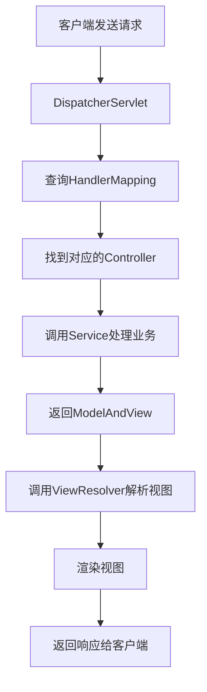

# JavaEE 简答题汇总

---

## 问题汇总
1. http常识、协议、返回值，html起什么作用 css js
2. jsp servlet里的一些常见概念、HttpRequest、HttpServlet、response起什么作用
3. mvc起什么作用
4. SpringMVC怎么操作
5. ORM的概念

---

## 1. HTTP常识、协议、返回值，HTML起什么作用，CSS，JS

### HTTP协议常识
- **HTTP协议**：超文本传输协议，基于TCP/IP的应用层协议，用于客户端和服务器之间的通信
- **主要特点**：无状态、无连接（HTTP/1.1支持持久连接）、基于请求/响应模型
- **端口**：默认端口80（HTTP）和443（HTTPS）

### HTTP请求方法
| 方法 | 用途 | 特点 |
|------|------|------|
| GET | 获取资源 | 参数在URL中，有长度限制 |
| POST | 提交数据 | 参数在请求体中，无长度限制 |
| PUT | 更新资源 |  |

### HTTP状态码
| 状态码 | 类别 | 常见示例 |
|--------|------|----------|
| 1xx | 信息响应 | 100 Continue |
| 2xx | 成功响应 | 200 OK, 201 Created |
| 3xx | 重定向 | 301 Moved Permanently |
| 4xx | 客户端错误 | 404 Not Found |
| 5xx | 服务器错误 | 500 Internal Server Error |

### 前端三剑客的作用
| 技术 | 作用 | 比喻 |
|------|------|------|
| **HTML** | 超文本标记语言，定义网页的结构和内容 | 骨架 |
| **CSS** | 层叠样式表，控制网页的样式和布局 | 外观 |
| **JavaScript** | 脚本语言，实现网页的交互行为和动态效果 | 行为 |

---

## 2. JSP Servlet里的常见概念、HttpRequest、HttpServlet、Response作用

### JSP（Java Server Pages）
- **定义**：基于Java的服务器端动态网页技术
- **特点**：允许在HTML中嵌入Java代码（`<% ... %>`）
- **生命周期**：JSP → 翻译成Servlet → 编译 → 执行

### Servlet
- **定义**：运行在服务器端的Java程序，处理HTTP请求并生成响应
- **生命周期**：
  1. **初始化**：`init()`方法
  2. **服务**：`service()`方法（调用`doGet()`/`doPost()`）
  3. **销毁**：`destroy()`方法

### HttpServletRequest的作用
- **获取客户端信息**：IP地址、端口、请求头
- **获取请求参数**：`getParameter()`、`getParameterValues()`
- **获取会话对象**：`getSession()`
- **获取作用域对象**：`getServletContext()`、`getRequestDispatcher()`
- **获取Cookie**：`getCookies()`

### HttpServletResponse的作用
- **设置响应状态**：`setStatus()`
- **设置响应头**：`setHeader()`、`addHeader()`
- **设置内容类型**：`setContentType()`
- **获取输出流**：`getWriter()`、`getOutputStream()`
- **重定向**：`sendRedirect()`
- **Cookie操作**：`addCookie()`

### 常见对象对比
| 对象 | 作用域 | 生命周期 |
|------|--------|----------|
| `HttpServletRequest` | 一次请求 | 请求开始到结束 |
| `HttpSession` | 一次会话 | 会话开始到超时或失效 |
| `ServletContext` | 整个应用 | 应用启动到关闭 |

---

## 3. MVC起什么作用

### MVC定义
- **MVC**：Model-View-Controller，一种软件设计模式
- **目的**：分离业务逻辑、数据和界面显示，降低耦合度

### 三个组件的职责
| 组件 | 职责 |
|------|------|
| **Model（模型）** | 处理应用程序数据逻辑；与数据库交互；通知View数据变化 |
| **View（视图）** | 显示数据给用户；接收用户输入；向Controller发送用户请求 |
| **Controller（控制器）** | 接收用户请求；调用Model处理业务；选择合适的View显示结果 |

### MVC在Java Web中的实现
| 组件 | Java Web实现 |
|------|--------------|
| Model | JavaBean、Service、DAO |
| View | JSP、HTML |
| Controller | Servlet、Struts Action、SpringMVC Controller |

### MVC的优点
1. **分离关注点**：业务逻辑与显示分离
2. **易于维护**：修改不影响其他组件
3. **代码重用**：模型和控制器可重用
4. **并行开发**：不同开发者可同时工作

### MVC的缺点
1. **增加复杂性**：简单的应用可能过度设计
2. **性能开销**：需要额外的协调工作

---

## 4. SpringMVC怎么操作

### SpringMVC核心组件
| 组件 | 作用 |
|------|------|
| `DispatcherServlet` | 前端控制器，统一接收请求并分发 |
| `HandlerMapping` | 请求映射处理器，将URL映射到Controller |
| `Controller` | 业务处理器 |
| `ViewResolver` | 视图解析器 |
| `ModelAndView` | 封装模型数据和视图信息 |

### SpringMVC工作流程


### 常用注解
| 注解 | 作用 |
|------|------|
| `@Controller` | 声明为控制器 |
| `@RequestMapping` | 映射请求URL |
| `@RequestParam` | 获取请求参数 |
| `@PathVariable` | 获取路径参数 |
| `@ResponseBody` | 返回JSON数据 |

### 参数绑定方式
| 参数类型 | 绑定方式 |
|----------|----------|
| 基本类型参数 | `@RequestParam` |
| 对象参数 | 自动绑定同名属性 |
| 路径参数 | `@PathVariable` |
| JSON参数 | `@RequestBody + 对象` |

---

## 5. ORM的概念

### ORM定义
- **ORM**：Object-Relational Mapping，对象关系映射
- **目的**：将面向对象的编程语言与关系数据库进行映射

### ORM核心思想
- 将数据库表映射为Java类
- 将表字段映射为类属性
- 将表记录映射为对象实例
- 将SQL操作封装为对象方法

### ORM框架举例
| 框架 | 特点 |
|------|------|
| Hibernate | 最流行的ORM框架 |
| MyBatis | 半自动ORM框架 |
| Spring Data JPA | 基于JPA规范 |
| JPA | Java持久化API规范 |

### Hibernate核心组件

#### 1. 实体类映射
```java
@Entity
@Table(name = "user")
public class User {
    @Id
    @GeneratedValue(strategy = GenerationType.IDENTITY)
    private Integer id;
    
    @Column(name = "username")
    private String username;
    
    @Column(name = "email")
    private String email;
    // getters/setters
}
```

#### 2. 核心组件
- **配置文件**：`hibernate.cfg.xml`
- **SessionFactory**：创建Session的工厂
- **Session**：主要操作接口
- **Transaction**：事务管理

### ORM的优点
1. **提高开发效率**：减少SQL编写
2. **对象化操作**：符合面向对象思想
3. **数据库无关性**：更换数据库方便
4. **缓存机制**：提高性能
5. **安全性**：防止SQL注入

### ORM的缺点
1. **学习成本**：需要学习框架
2. **性能问题**：复杂查询可能效率低
3. **灵活性限制**：某些复杂SQL难以实现
4. **调试困难**：生成的SQL不易调试


# javaEE编程题汇总

## 表单(填空)

### 1. 前端HTML表单 (form.html)
```html
<!DOCTYPE html>
<html>
<head>
    <title>简单表单示例</title>
</head>
<body>
    <h2>用户注册</h2>
    <form action="/demo/submit" method="POST">
        用户名：<input type="text" name="username"><br><br>
        邮箱：<input type="email" name="email"><br><br>
        年龄：<input type="number" name="age"><br><br>
        <input type="submit" value="提交">
    </form>
</body>
</html>
```

## Servlet(填空)

### 1. Servlet程序 (FormServlet.java)
```java
-------------一堆导包-----------------
// 最简单的Servlet类，继承HttpServlet
public class FormServlet extends HttpServlet {
    
    // 处理POST请求（表单提交）
    public void doPost(HttpServletRequest request, HttpServletResponse response)
            throws ServletException, IOException {
        // 设置响应内容类型和编码
        response.setContentType("text/html;charset=UTF-8");
        PrintWriter out = response.getWriter();
        // 1. 获取表单数据（核心代码只有这三行）
        String username = request.getParameter("username");
		-------------一堆获取表单-----------------
        // 2. 将年龄字符串转为整数
        int age = 0;
        try {
            age = Integer.parseInt(ageStr);
        } catch (NumberFormatException e) {
            age = 0;
        }
        // 3. 生成响应页面
        out.println("<html>");
		-------------一堆print-----------------
        out.close(); // 关闭输出流
    }
    // 也可以处理GET请求（可选）
    public void doGet(HttpServletRequest request, HttpServletResponse response)
            throws ServletException, IOException {
        // 将GET请求转发给POST方法处理
        doPost(request, response);
    }
}
```

### 2. web.xml配置（如果使用Servlet 3.0+，可用注解代替）
```xml
<?xml version="1.0" encoding="UTF-8"?>
<web-app>
    <servlet>
        <servlet-name>FormServlet</servlet-name>
        <servlet-class>FormServlet</servlet-class>
    </servlet>
    <servlet-mapping>
        <servlet-name>FormServlet</servlet-name>
        <url-pattern>/submit</url-pattern>
    </servlet-mapping>
</web-app>
```


### 工作流程：
1. 用户在 `form.html` 中输入数据并提交
2. 表单数据通过POST发送到 `/submit` URL
3. Servlet的 `doPost()` 方法被调用
4. 使用 `request.getParameter("字段名")` 获取数据
5. 生成响应页面返回给用户

**核心代码只有一行**：
```java
String username = request.getParameter("username");
```

## structs框架(填空，布置的作业)


## SpringMVC(Aop不考)：常见的注解、调用

项目结构
```
src/main/java/com/example/
├── HelloController.java
└── Application.java
```

#### 1.1 Spring Boot 启动类
```java
-------------一堆导包-----------------
@SpringBootApplication  // 核心注解：启用自动配置
public class Application {
    public static void main(String[] args) {
        SpringApplication.run(Application.class, args);
    }
}
```

#### 1.2 最简单的 Controller
```java
-------------一堆导包-----------------
@RestController  // = @Controller + @ResponseBody
public class HelloController {
    
    // 最简单的GET请求
    @GetMapping("/hello")
    public String hello() {
        return "Hello SpringMVC!";
    }
    
    // 带参数的GET请求
    @GetMapping("/greet/{name}")
    public String greet(@PathVariable String name) {
        return "Hello, " + name + "!";
    }
    
    // 接收表单参数的POST请求
    @PostMapping("/submit")
    public String submit(@RequestParam String username) {
        return "Received: " + username;
    }
}
```

#### 2. 核心注解速查表

| 注解 | 用途 | 示例 |
|------|------|------|
| **`@Controller`** | 声明为控制器 | `@Controller` |
| **`@RestController`** | REST控制器 | `@RestController` |
| **`@RequestMapping`** | 请求映射 | `@RequestMapping("/api")` |
| **`@GetMapping`** | GET请求 | `@GetMapping("/users")` |
| **`@PostMapping`** | POST请求 | `@PostMapping("/save")` |
| **`@RequestParam`** | 获取参数 | `@RequestParam("id")` |
| **`@PathVariable`** | 获取路径参数 | `@PathVariable Long id` |
| **`@RequestBody`** | 获取JSON参数 | `@RequestBody User user` |
| **`@ResponseBody`** | 返回JSON | `public User getUser()` |

### 3. 完整的三层架构示例

#### 3.1 实体类
```java
// User.java
public class User {
    private Long id;
    private String name;
    private String email;
    // getters/setters
}
```

#### 3.2 Controller层
```java
@RestController
@RequestMapping("/api/users")
public class UserController {
    
    @GetMapping("/{id}")
    public User getUser(@PathVariable Long id) {
        User user = new User();
        user.setId(id);
        user.setName("张三");
        return user;  // 自动转为JSON
    }
    
    @PostMapping("/create")
    public String createUser(@RequestBody User user) {
        return "创建成功: " + user.getName();
    }
}
```

### 4. 配置文件（非Spring Boot）

#### 4.1 web.xml
```xml
<!-- 配置DispatcherServlet -->
<servlet>
    <servlet-name>dispatcher</servlet-name>
    <servlet-class>org.springframework.web.servlet.DispatcherServlet</servlet-class>
</servlet>
<servlet-mapping>
    <servlet-name>dispatcher</servlet-name>
    <url-pattern>/</url-pattern>
</servlet-mapping>
```

#### 4.2 spring-mvc.xml
```xml
<?xml version="1.0" encoding="UTF-8"?>
<beans>
    <!-- 扫描Controller -->
    <context:component-scan base-package="com.example"/>
    
    <!-- 启用注解驱动 -->
    <mvc:annotation-driven/>
    
    <!-- 视图解析器 -->
    <bean class="org.springframework.web.servlet.view.InternalResourceViewResolver">
        <property name="prefix" value="/WEB-INF/views/"/>
        <property name="suffix" value=".jsp"/>
    </bean>
</beans>
```

### 5. 测试示例

#### 5.1 使用浏览器测试
```
GET http://localhost:8080/hello
GET http://localhost:8080/greet/张三
```

### 6. 快速记忆要点

1. **三个核心注解**：
   - `@Controller` / `@RestController`：标记控制器
   - `@RequestMapping` / `@GetMapping` / `@PostMapping`：映射URL
   - `@RequestParam` / `@PathVariable`：获取参数

2. **两种开发方式**：
   - **Spring Boot**：`@SpringBootApplication` 自动配置
   - **传统SpringMVC**：需要配置web.xml和spring-mvc.xml

3. **工作流程**：
   ```
   请求 → DispatcherServlet → Controller → 返回数据/视图
   ```

4. **参数绑定方式**：
   - URL参数：`@RequestParam`
   - 路径参数：`@PathVariable` 
   - JSON数据：`@RequestBody`
   - 表单数据：自动绑定

这个示例涵盖了SpringMVC考试中最常见的注解和用法，代码量最少但功能完整。

## mybatis(ssm，三个框架揉合，重点看最后一个项目)

以下内容节选自最后一次作业:

1.`controller`:

```java
-------------一堆导包-----------------

@Controller
@RequestMapping("/user")
public class UserController {

    //@Resource
    @Autowired
    private UserService userService;

    @RequestMapping("/findUser")
    public String findUser(Model model) {
        int id = 1;
        User user = this.userService.findUserById(id);
        model.addAttribute("user", user);
        return "index";
    }
	-------------一堆CRUD操作-----------------
        return "redirect:/user/getAllUser";
        // 转向书籍列表 action
    }
}
```
2. `/entity/User.java`:
```java
package cn.wmyskxz.entity;

public class User {
	private Integer id;
	public Integer getId() {
		return id;
	}

	public void setId(Integer id) {
		this.id = id;
	}

	-------------一堆getter、setter-----------------
	@Override
	public String toString() {
		return "User{" +
				"id=" + id +
				", username='" + username + '\'' +
				", isbn='" + isbn + '\'' +
				", author='" + author + '\'' +
				'}';
	}


}
```
3. `/mapper/UserDao.xml`:
```java
<?xml version="1.0" encoding="UTF-8"?>

<!DOCTYPE mapper PUBLIC "-//mybatis.org//DTD Mapper 3.0//EN" "http://mybatis.org/dtd/mybatis-3-mapper.dtd">

<!-- 设置为IUserDao接口方法提供sql语句配置 -->
<mapper namespace="cn.wmyskxz.dao.UserDao">

    <select id="findUserById" resultType="cn.wmyskxz.entity.User" parameterType="int">
        SELECT * FROM user WHERE id = #{id}
    </select>

	-------------一堆CRUD-----------------

    <!-- 查询全部用户-->
    <select id="getAllUsers" resultType="cn.wmyskxz.entity.User">
        select * from user
    </select>


</mapper>

```
4. `/service/UserService.java`:
```java
-------------一堆导包-----------------

@Service("userService")
public class UserServiceImpl implements UserService {

    //@Resource
    @Autowired
    private UserDao userDao;

    public User findUserById(int id) {
        return userDao.findUserById(id);
    }

	-------------一堆CRUD-----------------

}

```
6.`UserDao.java`
```java
-------------一堆导包-----------------

public interface UserDao {
    User findUserById(int id);
    List<User> getAllUsers();
    void addUser(User user);
    void deleteUser(int id);
    void deleteMuchByIds(List<String> lists);
    void updateUser(User user);
}
```


# javaEE补充

## 关于Spring

### Spring最核心的东西
- **IoC**（控制反转）：不考，但要知道作用
  - **作用**：避免用new来创建对象，而是容器、配置文件自动生成
  - **优点**：灵活，减少函数依赖
- **AOP**（面向切面编程）：不考

### Spring集成MVC
- Spring集成了MVC
- MVC概念：Model + Controller + View

### IoC的2种方法
1. **配置bean**：通过XML配置文件
2. **注解**（主流）：使用`@`注解符

`spring-mvc.xml`:需要写入以下配置以扫描注解符号
```xml
<context:component-scan base-package="com.atguigu.spring.beans" resource-pattern="autowire/*.class"/>
```

### 常见注解符
| 注解 | 说明 |
|------|------|
| `@Component` | 通用组件注解 |
| `@Service` | 服务层注解 |
| `@Repository` | 数据访问层注解 |
| `@Controller` | 控制器层注解 |
| `@Autowired` | 自动装配依赖 |

### 配置文件
使用配置文件之后需要配置Spring配置文件，通常为：
- `applicationContext.xml`
- `spring-mvc.xml`

### SpringMVC的工作流程(必须要掌握)：


## 关于Hibernate和myBatis
### 持久化：ORM框架要搞清楚
什么叫ORM：把对象和关系进行映射，用来存储
- Hibernate
1. 非常优秀、成熟的ORM框架
2. 完成对象的持久化操作
3. Hibernate允许开发者**采用面向对象的方式**来操作关系型数据库
4. 消除那些针对特定数据库厂商的SQL代码
- myBatis
1. 相比Hibernate灵活高，运行速度快
2. 开发速度慢，不支持纯粹面向对象操作，需要熟悉sql语句和优化功能

### myBatis需要会配置文件conf.xml

### myBatis需要会一对一的查询(eg.根据id查询得到一个user对象
```xml
<mapper>
<select id="getUser" parameterType="int" resultTypw="mw.gaci.domain.User">
	select * from users where id=#{id}
</select>
</mapper>
```
### 动态sql很重要，不考

### SSM的开发步骤
1. 先写实体类entity，定义对象的属性

2. 写mapper.xml，定义功能(对数据库的操作)

3. 写mapper.java，将mapper.xml中的操作按照id映射成java函数

4. 写service.java，为控制层提供服务，接受控制层参数，完成功能，返回给控制层

5. 写controller.java，连接页面请求和服务层，获取页面请求参数，处理函数处理参数，传给服务层

6. 写jsp页面调用，请求那些参数，获取哪些数据

## 关于EL表达式
EL表达式（Expression Language）的基本语法非常简洁：

**语法结构**：`${表达式}` 或 `#{表达式}`（后者用于JSF）

**核心功能**：
1. **访问作用域对象**：可直接访问`pageScope`、`requestScope`、`sessionScope`、`applicationScope`中的属性。例如`${user.name}`自动从各作用域查找`user`对象的`name`属性。
2. **访问集合**：
   - 数组/List：`${list[0]}`
   - Map：`${map.key}`
3. **运算符**：
   - 算术：`+`、`-`、`*`、`/`（或`div`）、`%`（或`mod`）
   - 关系：`==`（或`eq`）、`!=`（`ne`）、`<`（`lt`）、`>`（`gt`）、`<=`（`le`）、`>=`（`ge`）
   - 逻辑：`&&`（`and`）、`||`（`or`）、`!`（`not`）
   - 条件：`${condition ? trueValue : falseValue}`
4. **内置对象**：
   - 访问请求参数：`${param.name}`
   - 访问请求头：`${header["User-Agent"]}`
   - 访问Cookie：`${cookie.cookieName.value}`
示例：`${empty user ? "无用户" : user.username}`
EL表达式简化了JSP页面中的Java代码，使页面更简洁易读。

# javaEE考试
1. 选择题：15*2=30分
2. 简答题：5*6=30分
http协议+jsp概念+mvc+springmvc操作+orm
3. 程序设计题：5*8=40分(3个填空)
表单+servlet+structs+spring(AOP不考，考MVC)+mybatis(看最后一个项目)
